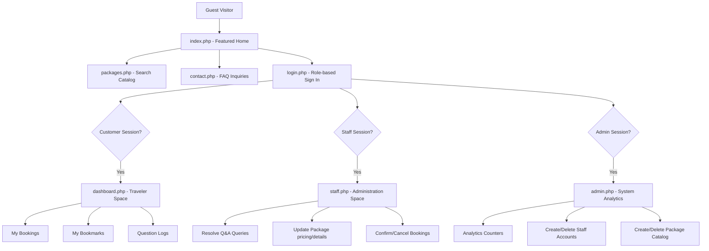
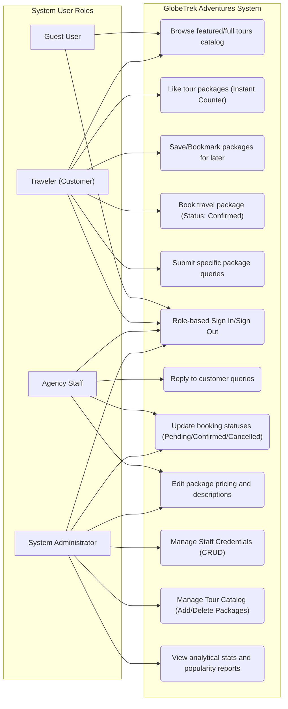
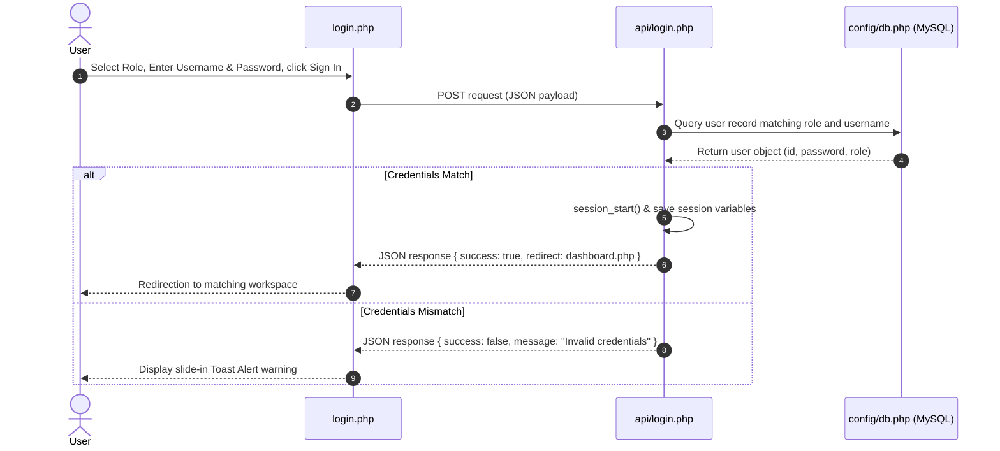
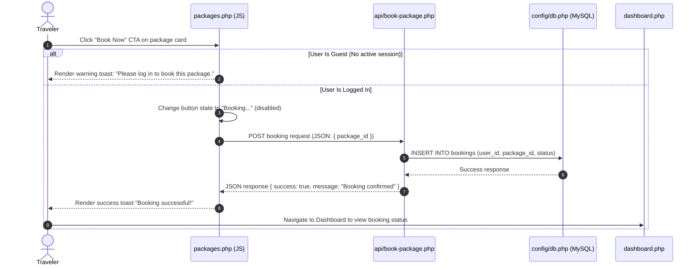
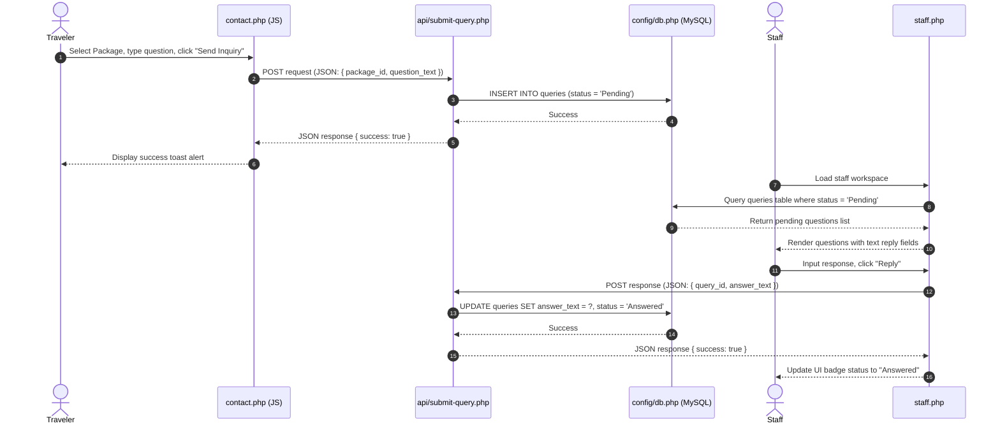

# GlobeTrek Adventures - PHP Web Application

GlobeTrek Adventures is a premium travel agency web application built with a secure PHP backend and a responsive vanilla frontend. It supports dynamic tour catalog navigation, booking operations, relational inquiry tracking, and role-based client administration.

---

## 🗺️ Site Map & Directory Structure

The page flow is divided into clear navigation structures and AJAX API endpoints:



### File Hierarchy
```plaintext
html_asna/
│
├── config/
│   └── db.php                  # Central PDO Database connection script
│
├── api/                        # Asynchronous AJAX endpoints returning JSON
│   ├── login.php               # Processes auth and establishes PHP session
│   ├── toggle-like.php         # Increments package likes dynamically
│   ├── toggle-save.php         # Toggles package bookmarks (Saved Packages)
│   ├── book-package.php        # Logs a new customer booking
│   ├── submit-query.php        # Submits customer questions or staff responses
│   ├── update-booking-status.php# Staff-controlled booking status updates
│   ├── update-package.php      # Staff-controlled package content modifications
│   ├── add-staff.php           # Admin-controlled staff registration
│   ├── delete-staff.php        # Admin-controlled staff removal
│   ├── add-package.php         # Admin-controlled package creation
│   └── delete-package.php      # Admin-controlled package deletion
│
├── css/
│   └── style.css               # Global stylesheets, custom HSL color palette, and micro-animations
│
├── js/
│   └── app.js                  # AJAX fetch requests, button active loading states, and toast triggers
│
├── images/                     # Holds tour packages photography assets
│
├── screenshots/                # Application page layout captures for assignment documentation
│
├── index.php                   # Customer Homepage (Featured catalog introduction)
├── packages.php                # Dedicated search and packages browsing page
├── contact.php                 # Dedicated contact details and Q&A inquiry forms
├── login.php                   # Secure credentials portal with role selection
├── logout.php                  # Destroys session variables and redirects
├── dashboard.php               # Customer Dashboard (My bookings, bookmarks, and queries status)
├── staff.php                   # Travel Agency Staff Dashboard
├── admin.php                   # Administrator Dashboard
└── schema.sql                  # MySQL Relational Database creation and seeds script
```

---

## 🎭 UML Use Case Diagram

The system supports three user actors (`Traveler/Customer`, `Agency Staff`, `Administrator`) plus the generic `Guest` visitor.



---

## 🔄 System Sequence Diagrams

### 1. User Authentication Sequence


### 2. Package Booking Flowchart Sequence


### 3. Customer Inquiry & Staff Reply Sequence


---

## 🗄️ Relational Database Schema

The database `globetrek_db` contains five tables linked with appropriate constraints and cascading deletions:

```plaintext
1. users: Stores travelers, travel agents, and administrators.
   - id (INT, PRIMARY KEY, AUTO_INCREMENT)
   - role (VARCHAR, CHECK: customer, staff, admin)
   - username (VARCHAR, UNIQUE)
   - password (VARCHAR)

2. packages: Stores travel tour package parameters.
   - id (INT, PRIMARY KEY, AUTO_INCREMENT)
   - destination (VARCHAR)
   - price (DECIMAL)
   - description (TEXT)
   - likes_count (INT)
   - image_url (VARCHAR)

3. saved_packages: Many-to-Many link tracking traveler bookmarks.
   - user_id (INT, FOREIGN KEY referencing users(id) ON DELETE CASCADE)
   - package_id (INT, FOREIGN KEY referencing packages(id) ON DELETE CASCADE)
   - saved_at (TIMESTAMP)
   - PRIMARY KEY (user_id, package_id)

4. queries: Relational table storing inquiries and staff resolutions.
   - id (INT, PRIMARY KEY, AUTO_INCREMENT)
   - user_id (INT, FOREIGN KEY referencing users(id) ON DELETE CASCADE)
   - package_id (INT, FOREIGN KEY referencing packages(id) ON DELETE CASCADE)
   - question_text (TEXT)
   - answer_text (TEXT, DEFAULT NULL)
   - status (VARCHAR, CHECK: Pending, Answered)
   - created_at (TIMESTAMP)

5. bookings: Relational table logging traveler package reservations.
   - id (INT, PRIMARY KEY, AUTO_INCREMENT)
   - user_id (INT, FOREIGN KEY referencing users(id) ON DELETE CASCADE)
   - package_id (INT, FOREIGN KEY referencing packages(id) ON DELETE CASCADE)
   - status (VARCHAR, CHECK: Pending, Confirmed, Cancelled, DEFAULT Confirmed)
   - booking_date (TIMESTAMP)
```

---

## 🚀 Setup & Installation Instructions

To deploy GlobeTrek Adventures locally using Apache + MySQL (e.g. XAMPP):

1. **Clone the repository**:
   Clone the code inside the XAMPP web root directory:
   `C:\xampp\htdocs\html_asna`

2. **Configure Database**:
   - Open XAMPP Control Panel and start **Apache** and **MySQL**.
   - Open phpMyAdmin (`http://localhost/phpmyadmin`) or MySQL Command Line.
   - Import the [schema.sql](schema.sql) file to create and seed `globetrek_db`.
     ```sql
     source C:/xampp/htdocs/html_asna/schema.sql;
     ```

3. **Establish Credentials Connection**:
   - Check the connection parameters in `config/db.php`. By default, it connects on `127.0.0.1` (localhost) with standard XAMPP configuration:
     - Username: `root`
     - Password: `""` (Empty string)

4. **Launch Application**:
   - Navigate to `http://localhost/html_asna/index.php` in your web browser.

---

## 🔑 Default Seed Credentials for Testing

Use the following seeded accounts to verify the different role access and dashboard controls:

| Role | Username | Password | Access Dashboard | Key Features to Test |
| :--- | :--- | :--- | :--- | :--- |
| **Guest** | *No Log In* | *No Password* | `index.php` / `packages.php` | Browse catalog, search packages. Clicking Like/Book/Star/Ask displays login warning toast. |
| **Traveler (Customer)** | `traveler_srilanka` | `traveler123` | `dashboard.php` | Book packages, toggle likes, bookmark tours, submit Q&A package inquiries. View active bookings and query reply statuses. |
| **Agency Staff** | `staff_negombo` | `staff123` | `staff.php` | Toggle booking status select dropdowns, reply inline to traveler inquiries, edit catalog package pricing/details. |
| **Administrator** | `admin_globetrek` | `admin123` | `admin.php` | View analytical stat cards. Create/delete staff accounts, create/delete tour packages. |
