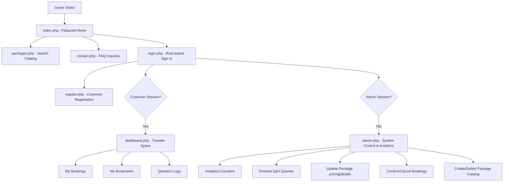
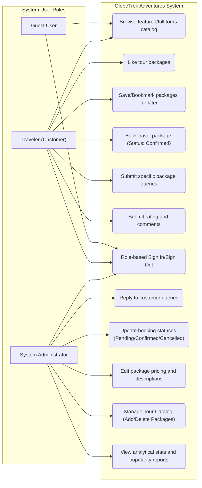
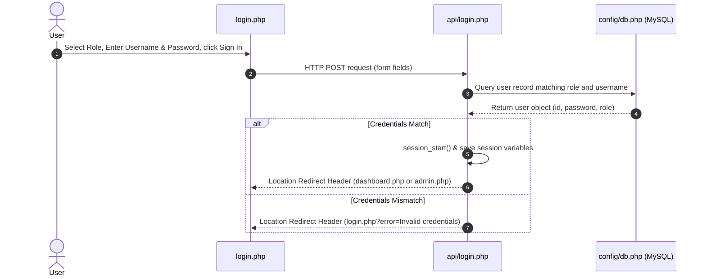
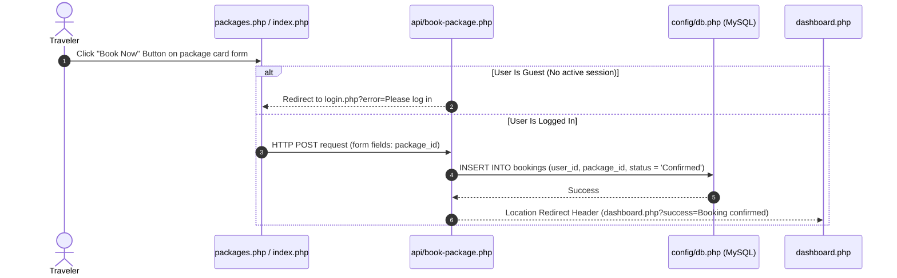
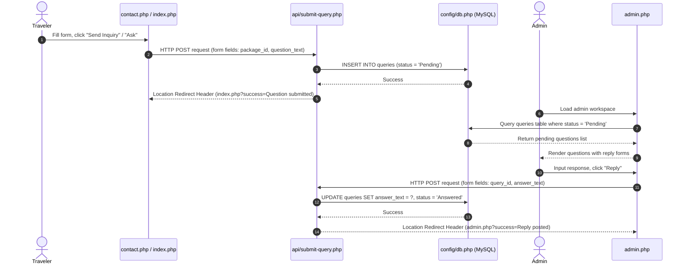
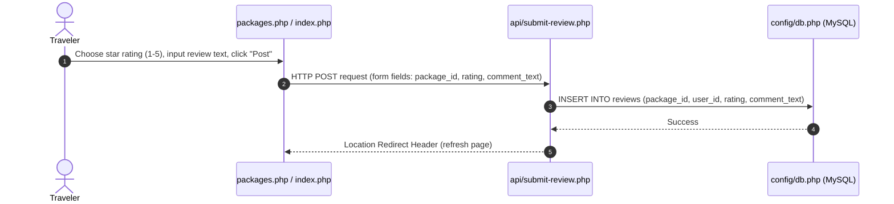

# GlobeTrek Adventures - PHP Web Application

GlobeTrek Adventures is a premium travel agency web application built with a secure PHP backend, a relational MySQL database, and a responsive vanilla CSS frontend. It supports dynamic tour catalog navigation, booking operations, relational review/rating modules, customer query tracking, and administrator-level content management.

---

## 🗺️ Site Map & Directory Structure

The page flow is divided into clear navigation structures and standard PHP form action endpoints. All actions are handled via HTTP POST or GET forms, which redirect back to refresh the current page view (or dashboard) preserving state:



### File Hierarchy & Description Map
```plaintext
html_asna/
│
├── config/
│   └── db.php                  # Central PDO Database connection script
│
├── api/                        # HTTP Form API Actions returning Location Redirects
│   ├── login.php               # Processes login credentials and starts session
│   ├── register.php            # Creates a new traveler account
│   ├── toggle-like.php         # Increments package likes count
│   ├── toggle-save.php         # Toggles package bookmarks (Saved Packages)
│   ├── book-package.php        # Logs a new customer booking
│   ├── submit-query.php        # Submits customer questions or admin replies
│   ├── submit-review.php       # Submits customer star ratings and comment reviews
│   ├── update-booking-status.php# Admin-controlled booking status updates
│   ├── update-package.php      # Admin-controlled package catalog updates
│   ├── add-package.php         # Admin-controlled package creation
│   └── delete-package.php      # Admin-controlled package deletion
│
├── css/
│   └── style.css               # Global HSL stylesheet, optimized to prevent layout shifts
│
├── images/                     # Holds tour package photography assets
│
├── screenshots/                # Application page layout captures
│
├── index.php                   # Customer Homepage (Featured top tours & testimonial details)
├── packages.php                # Tour packages browser (HTTP GET search filter)
├── contact.php                 # Support details and general FAQ submission form
├── login.php                   # Secure credentials portal with role selection
├── register.php                # Customer sign-up page (Traveler creation)
├── logout.php                  # Destroys session variables and redirects
├── dashboard.php               # Customer Dashboard (My bookings, bookmarks, and query status)
├── admin.php                   # Unified Administrator Dashboard
└── schema.sql                  # MySQL Relational Database creation and seeds script
```

---

## 📂 Detailed Code File Descriptions

### 1. Root User Interface Pages
* **`index.php`**: The main guest/customer landing page. Displays trust metrics, featured packages sorted by popularity (likes), and forms to like, bookmark, book, ask questions, or view and write reviews.
* **`packages.php`**: A full packages catalog browser. Includes an HTTP GET search form that queries packages by name/description, displays all packages, forms to interact (like, bookmark, book, ask, review), and active reviews lists.
* **`contact.php`**: General contact page with support details, hotline, and a general inquiry form linking to `api/submit-query.php` for any package.
* **`login.php`**: Secure credentials entry portal allowing users to log in as either `'customer'` (Traveler) or `'admin'` (Administrator).
* **`register.php`**: Customer sign-up page for guests to create a traveler account. Enforces basic password match validation.
* **`logout.php`**: Standard PHP script that destroys active session variables and redirects the user back to the homepage.
* **`dashboard.php`**: Customer portal displaying active bookings history, bookmarked packages, and query/question ticket statuses.
* **`admin.php`**: Unified Administrator Dashboard. Displays aggregate statistics, manages package additions/deletions, updates booking statuses, and resolves traveler inquiry questions.

### 2. Configuration & Styling
* **`config/db.php`**: Central connection script utilizing PHP Data Objects (PDO) to interface securely with MySQL.
* **`css/style.css`**: Clean, customized vanilla HSL stylesheet including custom card layouts and responsive styles, optimized to prevent visual layout shifts during image rendering.
* **`schema.sql`**: Complete MySQL database configuration script creating `globetrek_db` and standard tables: `users`, `packages`, `saved_packages`, `queries`, `bookings`, and `reviews`.

### 3. Backend API Scripts (`api/`)
* **`api/login.php`**: Validates credentials against the database and stores matching details in the PHP session, executing redirects.
* **`api/register.php`**: Inspects customer registration fields and creates new traveler accounts.
* **`api/toggle-like.php`**: Directly increments likes count in the database for a tour package.
* **`api/toggle-save.php`**: Inserts or deletes many-to-many package bookmarks/saves.
* **`api/book-package.php`**: Confirms a package booking transaction in the bookings ledger.
* **`api/submit-query.php`**: Enters a guest/traveler query or updates a resolved answer response for an administrator.
* **`api/submit-review.php`**: Stores rating scores (1-5) and customer reviews for package tours.
* **`api/update-booking-status.php`**: Facilitates administrative changes in bookings.
* **`api/update-package.php`**: Updates the price, description, and title of tour catalog items.
* **`api/add-package.php`**: Appends new tour packages to the catalogue.
* **`api/delete-package.php`**: Deletes tour packages and their cascading references.

---

## 🎭 UML Use Case Diagram

The system supports two user actors (`Traveler/Customer`, `Administrator`) plus the generic `Guest` visitor.



---

## 🔄 System Sequence Diagrams

### 1. User Authentication Sequence


### 2. Package Booking Sequence


### 3. Customer Inquiry & Admin Reply Sequence


### 4. Ratings and Reviews Sequence


---

## 🗄️ Relational Database Schema

The database `globetrek_db` contains six tables linked with appropriate constraints and cascading deletions:

```plaintext
1. users: Stores travelers and administrators.
   - id (INT, PRIMARY KEY, AUTO_INCREMENT)
   - role (VARCHAR, CHECK: customer, admin)
   - username (VARCHAR, UNIQUE)
   - password (VARCHAR)

2. packages: Stores travel tour package parameters.
   - id (INT, PRIMARY KEY, AUTO_INCREMENT)
   - destination (VARCHAR)
   - price (DECIMAL)
   - description (TEXT)
   - likes_count (INT)
   - image_url (VARCHAR)

3. saved_packages: Many-to-Many link tracking traveler bookmarks.
   - user_id (INT, FOREIGN KEY referencing users(id) ON DELETE CASCADE)
   - package_id (INT, FOREIGN KEY referencing packages(id) ON DELETE CASCADE)
   - saved_at (TIMESTAMP)
   - PRIMARY KEY (user_id, package_id)

4. queries: Relational table storing inquiries and admin resolutions.
   - id (INT, PRIMARY KEY, AUTO_INCREMENT)
   - user_id (INT, FOREIGN KEY referencing users(id) ON DELETE CASCADE)
   - package_id (INT, FOREIGN KEY referencing packages(id) ON DELETE CASCADE)
   - question_text (TEXT)
   - answer_text (TEXT, DEFAULT NULL)
   - status (VARCHAR, CHECK: Pending, Answered)
   - created_at (TIMESTAMP)

5. bookings: Relational table logging traveler package reservations.
   - id (INT, PRIMARY KEY, AUTO_INCREMENT)
   - user_id (INT, FOREIGN KEY referencing users(id) ON DELETE CASCADE)
   - package_id (INT, FOREIGN KEY referencing packages(id) ON DELETE CASCADE)
   - status (VARCHAR, CHECK: Pending, Confirmed, Cancelled, DEFAULT Confirmed)
   - booking_date (TIMESTAMP)

6. reviews: Relational table storing tour ratings and comment logs.
   - id (INT, PRIMARY KEY, AUTO_INCREMENT)
   - package_id (INT, FOREIGN KEY referencing packages(id) ON DELETE CASCADE)
   - user_id (INT, FOREIGN KEY referencing users(id) ON DELETE CASCADE)
   - rating (INT, CHECK: 1-5)
   - comment_text (TEXT)
   - created_at (TIMESTAMP)
```

---

## 🚀 Setup & Installation Instructions

To deploy GlobeTrek Adventures locally using Apache + MySQL (e.g. XAMPP):

1. **Clone the repository**:
   Clone the code inside the XAMPP web root directory:
   `C:\xampp\htdocs\html_asna`

2. **Configure Database**:
   - Open XAMPP Control Panel and start **Apache** and **MySQL**.
   - Open phpMyAdmin (`http://localhost/phpmyadmin`) or MySQL Command Line.
   - Import the [schema.sql](schema.sql) file to create and seed `globetrek_db`.
     ```sql
     source C:/xampp/htdocs/html_asna/schema.sql;
     ```

3. **Establish Credentials Connection**:
   - Check the connection parameters in `config/db.php`. By default, it connects on `127.0.0.1` (localhost) with standard XAMPP configuration:
     - Username: `root`
     - Password: `""` (Empty string)

4. **Launch Application**:
   - Navigate to `http://localhost/html_asna/index.php` in your web browser.

---

## 🔑 Default Seed Credentials for Testing

Use the following seeded accounts to verify the different role access and dashboard controls:

| Role | Username | Password | Access Dashboard | Key Features to Test |
| :--- | :--- | :--- | :--- | :--- |
| **Guest** | *No Log In* | *No Password* | `index.php` / `packages.php` | Browse catalog, search packages. Shows sign-in notices to Like/Book/Star/Ask/Review. |
| **Traveler (Customer)** | `traveler_srilanka` | `traveler123` | `dashboard.php` | Book packages, toggle likes, bookmark tours, submit Q&A queries, submit star ratings & reviews. View active bookings on dashboard. |
| **Administrator** | `admin_globetrek` | `admin123` | `admin.php` | View analytical stats. Manage package catalog (Add/Delete), update booking statuses, reply to traveler questions. |
